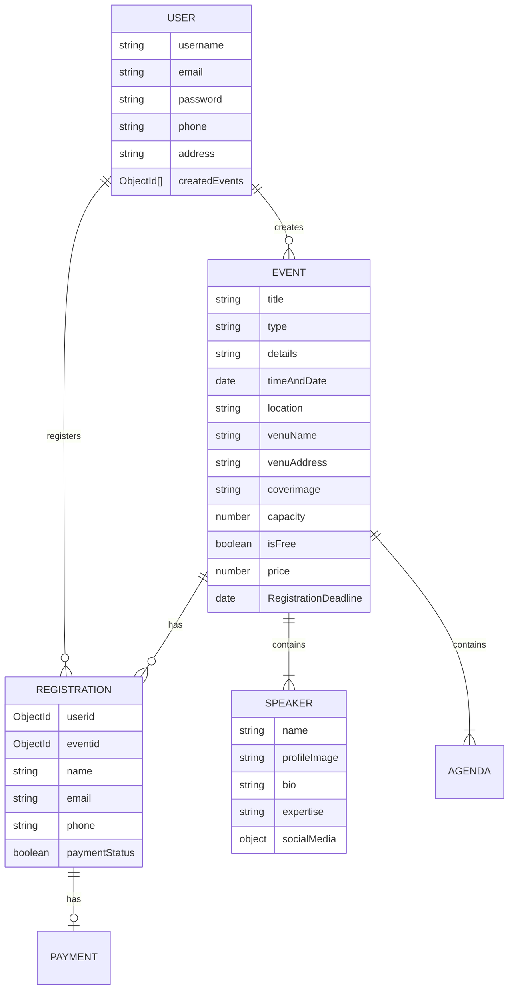

<div align="center">


### ✦ Discover · Create · Register — All in One Place ✦

A modern, **full-stack event management platform** with a stunning UI,  
built for seamless event discovery, creation, and registration.

<br />

[](https://nextjs.org/)
[](https://react.dev/)
[](https://www.mongodb.com/)
[](https://tailwindcss.com/)
[](https://www.framer.com/motion/)
[](https://cloudinary.com/)

 

</div>

 

---

## Preview
 
| Home Page | Event Discovery | Event Details | Dashboard |
|:---------:|:---------------:|:-------------:|:---------:|
| Hero section with animated carousel & CTA | Smart search, filters & paginated cards | Speakers, agenda, countdown & venue map | Sidebar navigation with event management |

 
---

## ✨ Features at a Glance

<table>
<tr>
<td width="50%">

### 🔍 Smart Discovery
- **Real-time Search** — Debounced search by event title
- **Category Filters** — Conference, Workshop, Seminar, Webinar, Meetup
- **Paginated Results** — Smooth navigation through large event lists

</td>
<td width="50%">

### 🎯 Event Management
- **Multi-Step Creation** — Speakers, agenda, venue & pricing
- **Image Uploads** — Cover images via Cloudinary CDN
- **Edit & Delete** — Full CRUD with owner authorization

</td>
</tr>
<tr>
<td width="50%">

### 🎟️ Registration System
- **One-Click Registration** — Register for events instantly
- **Duplicate Prevention** — Smart validation blocks double sign-ups
- **Countdown Timer** — Live deadline tracking for registrations

</td>
<td width="50%">

### 📊 User Dashboard
- **My Events** — View and manage your created events
- **Registrations** — Track events you've registered for
- **Create & Edit** — Dedicated dashboard workflow for organizers

</td>
</tr>
<tr>
<td width="50%">

### 🔐 Authentication & Security
- **JWT Auth** — Secure cookie-based token authentication
- **Bcrypt Hashing** — Industry-standard password encryption
- **Protected Routes** — Middleware-guarded API & pages

</td>
<td width="50%">

### 🎨 Modern UI/UX
- **Responsive Design** — Mobile-first, works on all devices
- **Framer Motion** — Smooth page transitions & micro-animations
- **Hero Carousel** — Auto-rotating background slideshow
- **Interactive Map** — Leaflet-powered venue location display

</td>
</tr>
</table>

---

## 🛠️ Tech Stack

| Layer | Technology | Purpose |
|:------|:-----------|:--------|
| **Framework** | [Next.js 15](https://nextjs.org/) | App Router, API Routes, Turbopack |
| **Frontend** | [React 19](https://react.dev/) | Component-based UI |
| **UI Library** | [HeroUI](https://www.heroui.com/) | Pre-built accessible components |
| **Styling** | [Tailwind CSS](https://tailwindcss.com/) | Utility-first CSS framework |
| **Animations** | [Framer Motion](https://www.framer.com/motion/) | Smooth transitions & effects |
| **State** | [Zustand](https://zustand-demo.pmnd.rs/) | Lightweight global state |
| **Server State** | [TanStack React Query](https://tanstack.com/query) | Caching, refetching & sync |
| **Forms** | [React Hook Form](https://react-hook-form.com/) | Performant form handling |
| **Validation** | [Zod](https://zod.dev/) | TypeScript-first schema validation |
| **Database** | [MongoDB](https://www.mongodb.com/) + [Mongoose](https://mongoosejs.com/) | NoSQL database & ODM |
| **Auth** | JWT + bcryptjs | Token-based authentication |
| **Storage** | [Cloudinary](https://cloudinary.com/) | Image upload & CDN delivery |
| **Maps** | [Leaflet](https://leafletjs.com/) + React Leaflet | Interactive venue maps |
| **Notifications** | [React Toastify](https://fkhadra.github.io/react-toastify/) | Toast notifications |
| **Icons** | [Heroicons](https://heroicons.com/) + [React Icons](https://react-icons.github.io/) | SVG icon libraries |
| **HTTP** | [Axios](https://axios-http.com/) | API request handling |

---

## 📁 Project Structure

```
event-hub/
├── public/                          # Static assets & event images
├── src/
│   ├── app/
│   │   ├── (auth)/                  # 🔐 Login & Signup pages
│   │   ├── api/
│   │   │   ├── events/              # Event CRUD endpoints
│   │   │   │   ├── [id]/register/   # Event registration API
│   │   │   │   └── registerevent/   # Create event (with Cloudinary)
│   │   │   ├── login/               # Authentication endpoint
│   │   │   └── register/            # User registration endpoint
│   │   ├── dashboard/
│   │   │   ├── create-event/        # 📝 Create new event
│   │   │   ├── edit-event/          # ✏️ Edit existing event
│   │   │   ├── explore/             # 🔍 Browse all events
│   │   │   ├── my-events/           # 📋 User's created events
│   │   │   └── registrations/       # 🎟️ User's registrations
│   │   ├── events/
│   │   │   └── [id]/                # Event detail page
│   │   ├── about/                   # ℹ️ About page
│   │   └── contact/                 # 📞 Contact page
│   ├── components/
│   │   ├── cards/                   # EventCard, WhyEventHubCard
│   │   ├── dashboard/               # Dashboard sidebar & layout
│   │   ├── EventPage/               # Event listing & detail views
│   │   │   └── EventDetail/         # Speaker carousel, agenda, countdown
│   │   ├── form/                    # Multi-step event creation forms
│   │   ├── home/                    # Hero, categories, upcoming events
│   │   ├── navbar/                  # Navbar & Footer
│   │   └── searchbar/               # Search & filter bar
│   ├── hooks/                       # Custom React Query hooks
│   ├── lib/                         # Utilities, DB config, auth helpers
│   │   └── validators/              # Zod validation schemas
│   ├── models/                      # Mongoose data models
│   ├── services/                    # Business logic layer
│   └── stores/                      # Zustand state stores
├── seed.mjs                         # Database seeder script
├── .env                             # Environment variables
└── package.json
```

---

## 🗄️ Database Schema



---

## 📡 API Reference

| Method | Endpoint | Description | Auth |
|:------:|:---------|:------------|:----:|
| `POST` | `/api/register` | Register a new user | ❌ |
| `POST` | `/api/login` | Login & receive JWT cookie | ❌ |
| `GET` | `/api/events` | Get events (paginated + filtered) | ❌ |
| `GET` | `/api/events?id={id}` | Get single event by ID | ❌ |
| `POST` | `/api/events/registerevent` | Create a new event | ✅ |
| `PUT` | `/api/events?id={id}` | Update an event | ✅ |
| `DELETE` | `/api/events?id={id}` | Delete an event | ✅ |
| `POST` | `/api/events/[id]/register` | Register for an event | ✅ |

<details>
<summary>📋 <strong>Query Parameters for <code>GET /api/events</code></strong></summary>

| Param | Type | Default | Description |
|:------|:-----|:--------|:------------|
| `page` | number | `1` | Page number |
| `limit` | number | `10` | Events per page |
| `search` | string | — | Search by event title |
| `type` | string | — | Filter by event type |
| `category` | string | — | Filter by category |
| `createdBy` | ObjectId | — | Filter by creator |

</details>

---

## 🚀 Getting Started

### Prerequisites

| Requirement | Version | Link |
|:------------|:--------|:-----|
| Node.js | 18+ | [Download](https://nodejs.org/) |
| MongoDB | Latest | [Install](https://www.mongodb.com/docs/manual/installation/) or [Atlas](https://www.mongodb.com/atlas) |
| Cloudinary | Free tier | [Sign Up](https://cloudinary.com/) |

### Installation

```bash
# 1. Clone the repository
git clone https://github.com/Muhammad-Hammad-59/EventsHub.git
cd EventsHub/event-hub

# 2. Install dependencies
npm install

# 3. Set up environment variables
cp .env.example .env
```

Create a `.env` file with the following:

```env
MONGODB_URI="mongodb://127.0.0.1:27017/eventhub"
TOKEN_SECRET="your_jwt_secret_key_here"
CLOUDINARY_CLOUD_NAME="your_cloud_name"
CLOUDINARY_API_KEY="your_api_key"
CLOUDINARY_API_SECRET="your_api_secret"
```

```bash
# 4. (Optional) Seed the database with sample data
node seed.mjs

# 5. Start the development server
npm run dev
```

Open [http://localhost:3000](http://localhost:3000) in your browser 🎉

---

## 📜 Available Scripts

| Command | Description |
|:--------|:------------|
| `npm run dev` | Start development server with Turbopack ⚡ |
| `npm run build` | Create optimized production build |
| `npm start` | Start production server |
| `npm run lint` | Run ESLint for code quality |
| `node seed.mjs` | Seed database with sample events |

---

## 🤝 Contributing

Contributions are what make the open source community amazing! Any contributions you make are **greatly appreciated**.

1. **Fork** the repository
2. **Create** your feature branch → `git checkout -b feature/AmazingFeature`
3. **Commit** your changes → `git commit -m "Add AmazingFeature"`
4. **Push** to the branch → `git push origin feature/AmazingFeature`
5. **Open** a Pull Request

---

## 📄 License

Distributed under the **MIT License**. See [`LICENSE`](LICENSE) for more information.

---

<div align="center">

<br />

**Built with ❤️ and ☕ by [Muhammad Hammad](https://github.com/Muhammad-Hammad-59)**

 

</div>